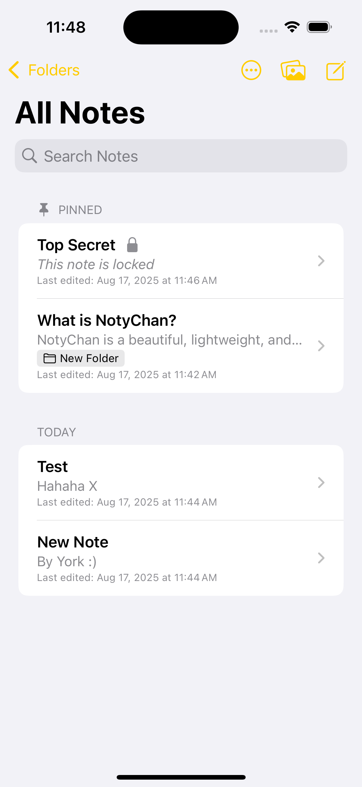

# 📸 NotyChan – Screenshots

A visual tour of NotyChan across iOS, iPadOS, macOS, and watchOS.  
All images are stored in `docs/Screenshots/`.

---

## iOS

<table>
  <tr>
    <td align="center">
      <figure>
        
        <figcaption><strong>All Notes</strong> Browse and pin your notes</figcaption>
      </figure>
    </td>
    <td align="center">
      <figure>
        
        <figcaption><strong>Folders</strong> Organize notes the simple way</figcaption>
      </figure>
    </td>
    <td align="center">
      <figure>
        
        <figcaption><strong>Sort &amp; Group</strong> Title / Modified, A–Z / Date</figcaption>
      </figure>
    </td>
  </tr>
  <tr>
    <td align="center">
      <figure>
        
        <figcaption><strong>Multi-Select</strong> Move, delete, restore in bulk</figcaption>
      </figure>
    </td>
    <td align="center">
      <figure>
        
        <figcaption><strong>Recently Deleted</strong> Auto-purge after 30 days</figcaption>
      </figure>
    </td>
    <td align="center">
      <figure>
        
        <figcaption><strong>Archive</strong> Keep things without clutter</figcaption>
      </figure>
    </td>
  </tr>
</table>

### iOS – Security

<table>
  <tr>
    <td align="center">
      <figure>
        
        <figcaption><strong>Lock Folder</strong> Face ID / Touch ID support</figcaption>
      </figure>
    </td>
    <td align="center">
      <figure>
        
        <figcaption><strong>Locked Note</strong> Privacy on a per-note basis</figcaption>
      </figure>
    </td>
  </tr>
</table>

## iOS - Gallery

<table>
  <tr>
      <td align="center">
      <figure>
        
        <figcaption><strong>Note Gallery</strong> Per-note images with captions</figcaption>
      </figure>
    </td>
    <td align="center">
      <figure>
        
        <figcaption><strong>Gallery Viewer</strong> Browse photos added to a note</figcaption>
      </figure>
    </td>
  </tr>
</table>

---

## iPadOS

  

<em>Optimized for iPad.</em>

---

## macOS

<table>
  <tr>
    <td align="center">
      <figure>
        
        <figcaption><strong>All Notes</strong> Desktop-class navigation</figcaption>
      </figure>
    </td>
    <td align="center">
      <figure>
        
        <figcaption><strong>Rich Editor</strong> Fonts, colors, alignment, and more</figcaption>
      </figure>
    </td>
  </tr>
</table>

---

## watchOS

<table>
  <tr>
    <td align="center">
      <figure>
        
        <figcaption><strong>Folders</strong> Quick access on your wrist</figcaption>
      </figure>
    </td>
    <td align="center">
      <figure>
        
        <figcaption><strong>All Notes</strong> Browse synced notes (text)</figcaption>
      </figure>
    </td>
    <td align="center">
      <figure>
        
        <figcaption><strong>Locked Note</strong> Respects your privacy settings</figcaption>
      </figure>
    </td>
  </tr>
  <tr>
    <td align="center" colspan="3">
      <figure>
        
        <figcaption><strong>Viewer</strong> Read notes in plain text</figcaption>
      </figure>
    </td>
  </tr>
</table>

---

  <a href="../README.md">← Home</a> 

